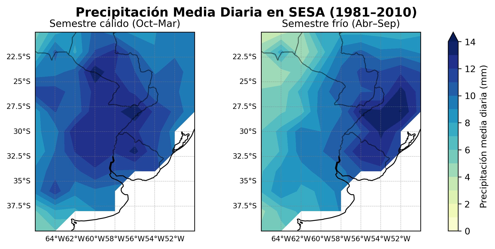
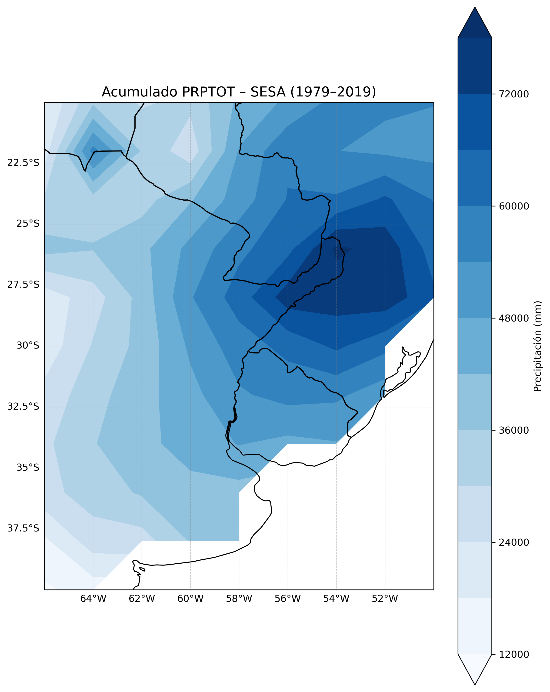
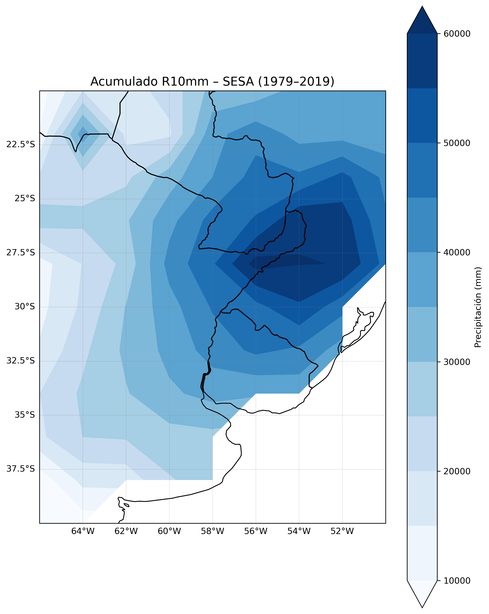
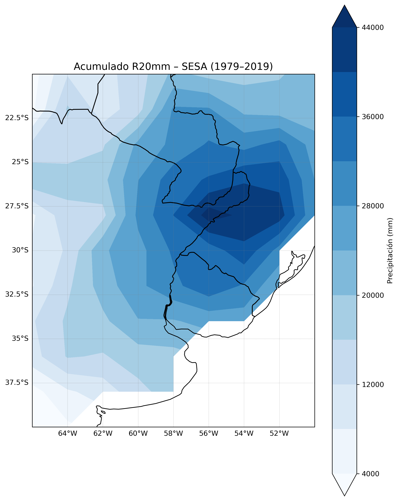
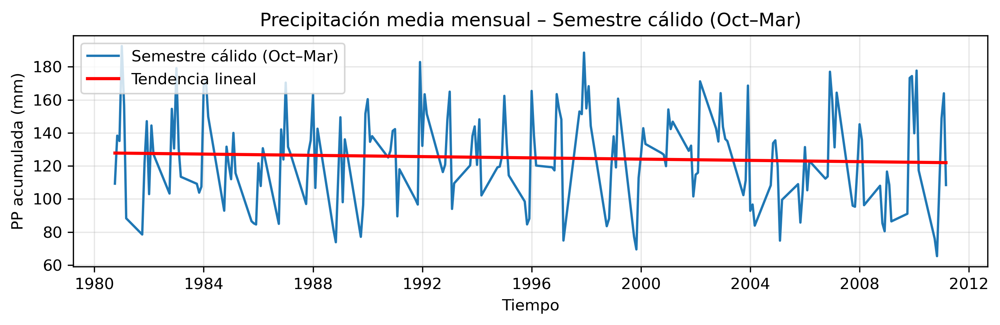
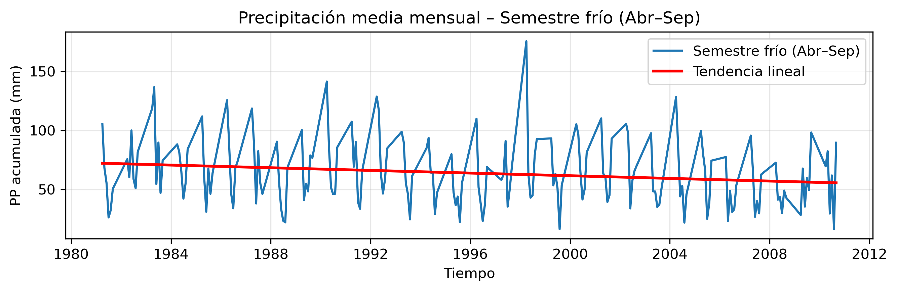

# Precipitation Analysis in Southeastern South America (SESA)
# Análisis de Precipitación en el Sudeste de Sudamérica (SESA)

---

## 🇬🇧 English

### Overview
Analysis of daily precipitation data over the **Southeastern South America (SESA)** region (20°S–40°S, 50°W–66°W) for the period **1979–2019**, using CPC gauge-based gridded data provided by NOAA.

The project focuses on characterizing precipitation patterns through seasonal analysis, extreme rainfall indices, and temporal trend detection.

### Objectives
- Identify and handle missing values in gridded NetCDF data
- Calculate mean daily precipitation for warm (Oct–Mar) and cold (Apr–Sep) semesters over the reference period 1981–2010
- Compute standard precipitation indices: **PRPTOT**, **R10mm**, and **R20mm**
- Analyze areal-averaged temporal trends for each semester

### Methods & Tools
| Tool | Use |
|------|-----|
| Python 3 | Main language |
| NumPy | Array operations and spatial masking |
| Pandas | Time series construction and aggregation |
| Matplotlib | Data visualization |
| Cartopy | Geospatial map plotting |
| netCDF4 | Reading NetCDF climate datasets |

### Results

#### Mean Daily Precipitation (1981–2010)
Spatial distribution of mean daily precipitation on rainy days (> 1 mm) for each semester.



#### Precipitation Indices
Accumulated precipitation above different thresholds over the full period (1979–2019).

| Index | Description |
|-------|-------------|
| PRPTOT | Total accumulated precipitation on rainy days (> 1 mm) |
| R10mm | Accumulated precipitation on days with PP > 10 mm |
| R20mm | Accumulated precipitation on days with PP > 20 mm |





#### Temporal Trends
Monthly areal-averaged precipitation with linear trend for each semester.




### Dataset
The dataset used is **CPC Global Unified Gauge-Based Analysis of Daily Precipitation**, provided by NOAA's Physical Sciences Laboratory.

📥 Download: [https://psl.noaa.gov/data/gridded/data.cpc.globalprecip.html](https://psl.noaa.gov/data/gridded/data.cpc.globalprecip.html)

Once downloaded, rename the file to `precip.CPC.nc` and place it in the same folder as the script before running.

### How to Run
```bash
# 1. Clone the repository
git clone https://github.com/YOUR_USERNAME/precipitacion-SESA-analisis.git
cd precipitacion-SESA-analisis

# 2. Install dependencies
pip install numpy pandas matplotlib cartopy netCDF4

# 3. Place the dataset in the folder (see Dataset section above)

# 4. Run the script
python TP_FINAL_Cristobal_CORREGIDO.py
```

Output plots will be saved in the `Carpeta_guardado/` folder.

### Author
**Ignacio N. Cristobal**
Student – Bachelor's Degree in Atmospheric Sciences, Universidad de Buenos Aires (UBA)
📧 ignaciocristobal91@gmail.com

---

## 🇦🇷 Español

### Descripción
Análisis de datos de precipitación diaria sobre la región del **Sudeste de Sudamérica (SESA)** (20°S–40°S, 50°O–66°O) para el período **1979–2019**, utilizando datos grillados CPC de la NOAA.

El proyecto caracteriza los patrones de precipitación mediante análisis estacional, índices de lluvias extremas y detección de tendencias temporales.

### Objetivos
- Identificar y tratar datos faltantes en archivos NetCDF grillados
- Calcular la precipitación media diaria en días lluviosos para el semestre cálido (oct–mar) y frío (abr–sep) en el período de referencia 1981–2010
- Calcular índices estándar de precipitación: **PRPTOT**, **R10mm** y **R20mm**
- Analizar tendencias temporales del promedio areal para cada semestre

### Herramientas
| Herramienta | Uso |
|-------------|-----|
| Python 3 | Lenguaje principal |
| NumPy | Operaciones matriciales y máscaras espaciales |
| Pandas | Series temporales y agregación |
| Matplotlib | Visualización |
| Cartopy | Mapas geoespaciales |
| netCDF4 | Lectura de datos climáticos en formato NetCDF |

### Resultados

#### Precipitación Media Diaria (1981–2010)
Distribución espacial de la precipitación media diaria en días lluviosos (> 1 mm) por semestre.


#### Índices de Precipitación
Precipitación acumulada por encima de distintos umbrales para todo el período (1979–2019).

| Índice | Descripción |
|--------|-------------|
| PRPTOT | Acumulado total en días lluviosos (> 1 mm) |
| R10mm | Acumulado en días con PP > 10 mm |
| R20mm | Acumulado en días con PP > 20 mm |


#### Tendencias Temporales
Precipitación mensual promedio areal con tendencia lineal para cada semestre.


### Dataset
Se utilizó el dataset **CPC Global Unified Gauge-Based Analysis of Daily Precipitation** provisto por el Physical Sciences Laboratory de la NOAA.

📥 Descarga: [https://psl.noaa.gov/data/gridded/data.cpc.globalprecip.html](https://psl.noaa.gov/data/gridded/data.cpc.globalprecip.html)

Una vez descargado, renombrá el archivo como `precip.CPC.nc` y colocalo en la misma carpeta que el script antes de ejecutarlo.

### Cómo ejecutar
```bash
# 1. Clonar el repositorio
git clone https://github.com/YOUR_USERNAME/precipitacion-SESA-analisis.git
cd precipitacion-SESA-analisis

# 2. Instalar dependencias
pip install numpy pandas matplotlib cartopy netCDF4

# 3. Colocar el dataset en la carpeta (ver sección Dataset)

# 4. Ejecutar el script
python TP_FINAL_Cristobal_CORREGIDO.py
```

Los gráficos se guardan automáticamente en la carpeta `Carpeta_guardado/`.

### Autor
**Ignacio N. Cristobal**
Estudiante – Licenciatura en Ciencias de la Atmósfera, Universidad de Buenos Aires (UBA)
📧 ignaciocristobal91@gmail.com
